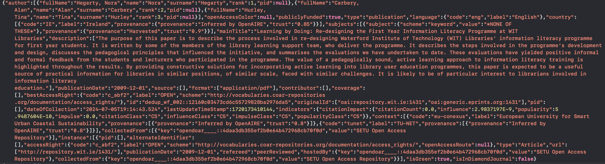
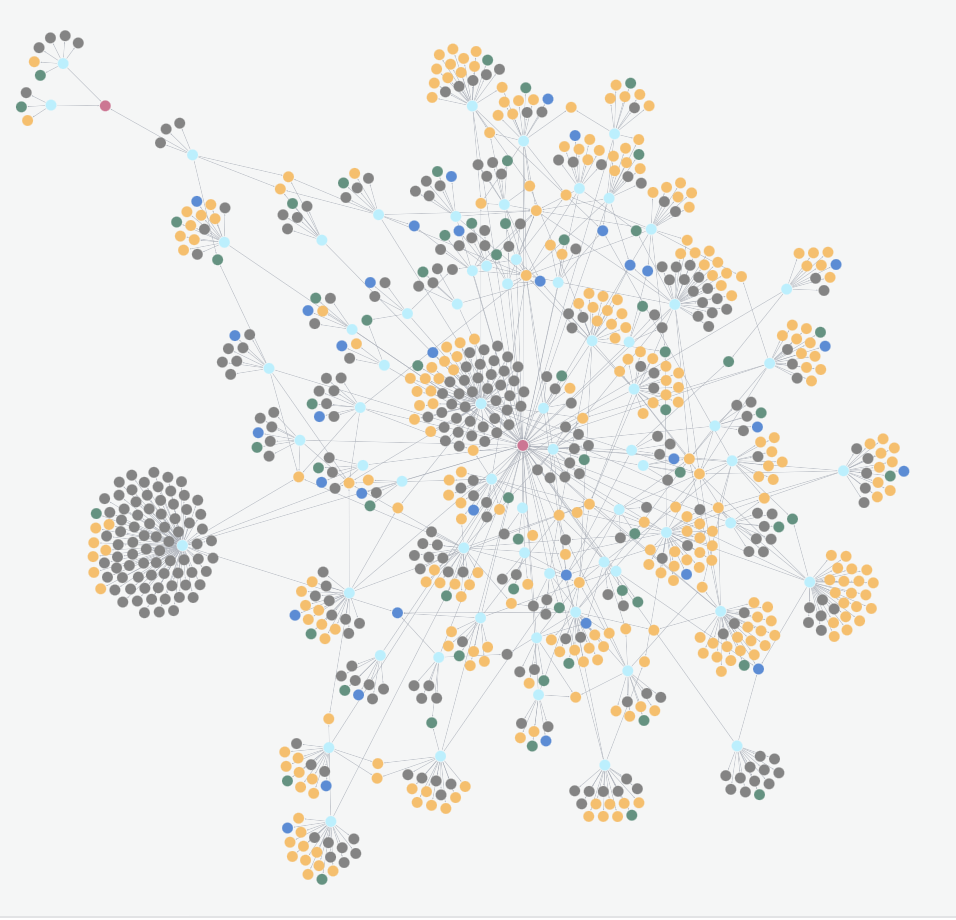
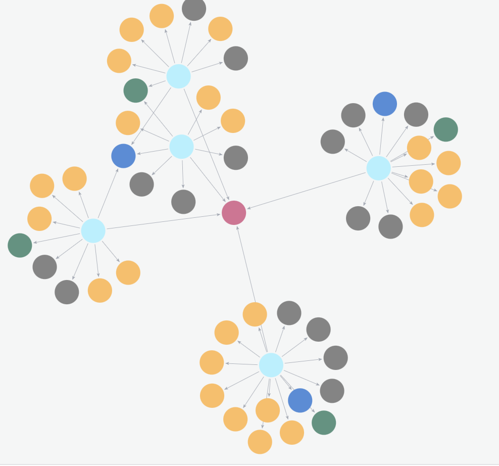
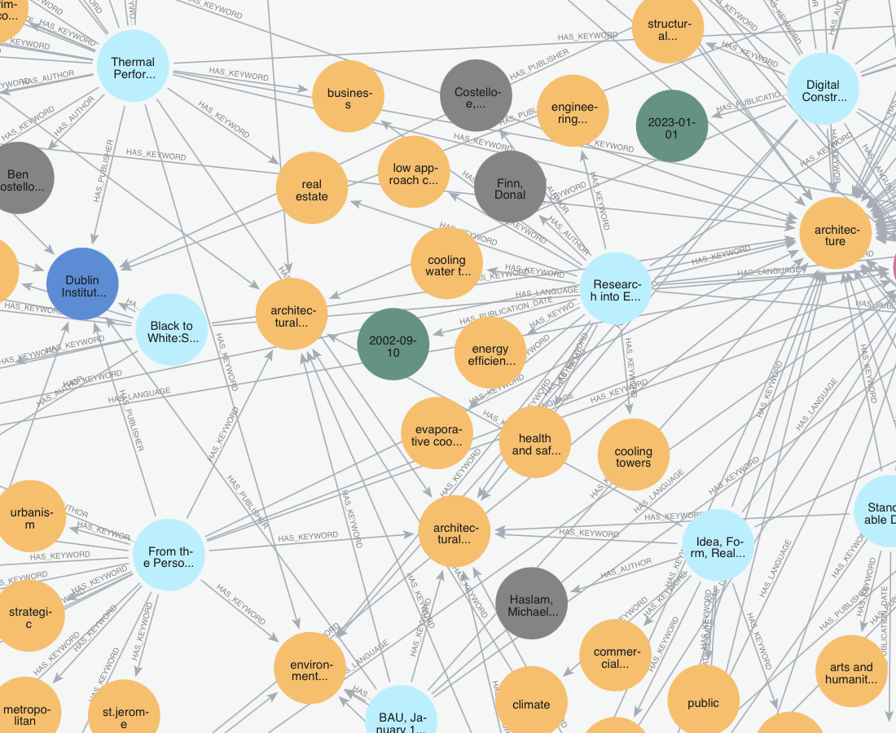

% Developing Knowledge Graph Based On OpenAire Database

---

# Table of contents

1. Goal

2. What is the OpenAIRE Graph?

3. Dataset overview

4. Data structure

5. Implementation steps

6. Visualization of Knowledge Graph

7. Usage examples

8. Sources

---

# Goal

To develop a knowledge graph based on the OpenAIRE dataset to extract information about the most important research papers.


---

# What is the OpenAIRE Graph?


The OpenAIRE Graph is a free and open resource that brings together and interlinks hundreds of millions of metadata records from over 100k data sources trusted by researchers.

---

# Dataset overview

The dataset selected contains metadata records of the OpenAIRE Graph for the research community "Technological University Network (TU-NET)." 

TU-NET is a network for the Irish Technological Universities to share expertise, information and resources

---

# Data structure

The dataset is stored in multiple archive files, where each line represents a metadata record. Below is an example of a single line from the dataset:



---

# Implementation steps

1. Read each line from all archive files and store it in a variable.

{ width=350px }

---

# Implementation steps

2. Convert the data into CSV format by selecting relevant fields. Each CSV file represents a node in the knowledge graph.

{ width=350px }

---

# Implementation steps

3. Preprocess and clean the data to ensure consistency and accuracy.

{ width=350px }

---

# Implementation steps

4. Connect to Neo4j Aura (console) using the Neo4j library.

{ width=350px }

---

# Implementation steps

5. Use Cypher queries to establish relationships between the nodes.

{ width=350px }

---

# Implementation steps

6. Upload the processed data into the Neo4j database.

{ width=350px }

---

# Visualization of Knowledge Graph

{ width=350px }

---

# Usage examples

The following Cypher query retrieves the most cited records in English:


```sql
MATCH (r:Record)-[:HAS_LANGUAGE]->(l:Language)
WHERE r.citationCount IS NOT NULL AND l.language = 'English'
WITH r
ORDER BY r.citationCount DESC
LIMIT 5

MATCH p=(r)-[rel]-(m)
RETURN p
```


---

# Usage examples

{ width=350px }

---

# Usage examples

All records associated with the keyword architecture

{ width=300px }

---

# Sources

1. OpenAire Graph - https://graph.openaire.eu

2. Neo4j documentation -  https://neo4j.com/docs/getting-started/languages-guides/neo4j-python/

3. Dataset source - https://zenodo.org/records/13135167 


