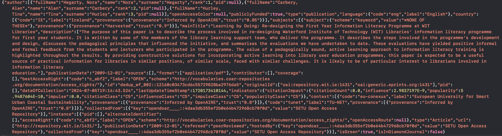
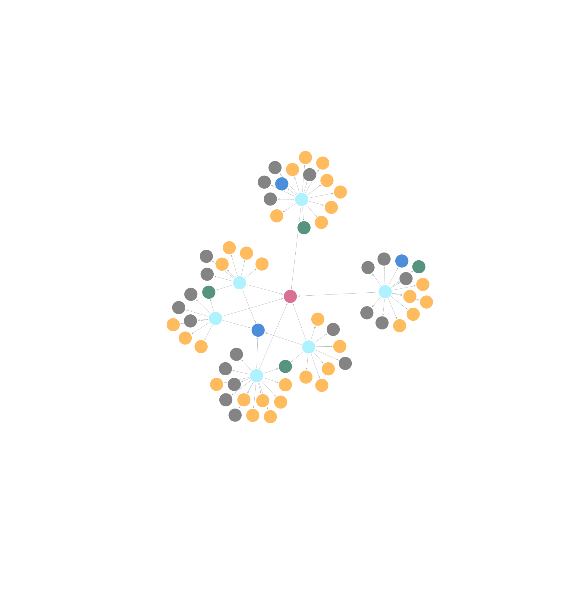

% Developing Knowledge Graph Based On OpenAire Database

---

# Table of contents

1. Intruduction
2. Quality of Knowledge Graph

    2.1. Quality Metrics for Knowledge Graph

    2.2. Approaches and Tools for Evaluating Quality of Knowledge Graph
3. A Recommended Framework for Quality Evaluation of Knowledge Graph
4. Related Work
5. Summary and future directions

---

# Goal

To make a knowledge graph base on OpenAire dataset to find information about the most important papers

---

# What is the OpenAIRE Graph?

The OpenAIRE Graph is a free and open resource that brings together and interlinks hundreds of millions of metadata records from over 100k data sources trusted by researchers.

---

# Dataset

Dataset I chose contains metadata records of the OpenAIRE Graph for the research communities and initiatives

Research community is Technological University Network (TU-NET). TU-NET is a network for the Irish Technological Universities to share expertise, information and resources

---

# Dataset

The data is represented in many archive files

One line of the file look like below 

---

# Steps

1. Go through every line in every file adding it to a variable
2. Convering the data into csv files, selecting appropriate fields. Each csv file will represent a node in the graph
3. Cleaning the data
4. Using neo4j library connect to neo4j aura (console)
5. Create relations between the data using Cypher
6. Upload the data into neo4j 

---

# Visualization of Knowledge Graph

---

# Usage

Top 5 records the most citated records on English

---
